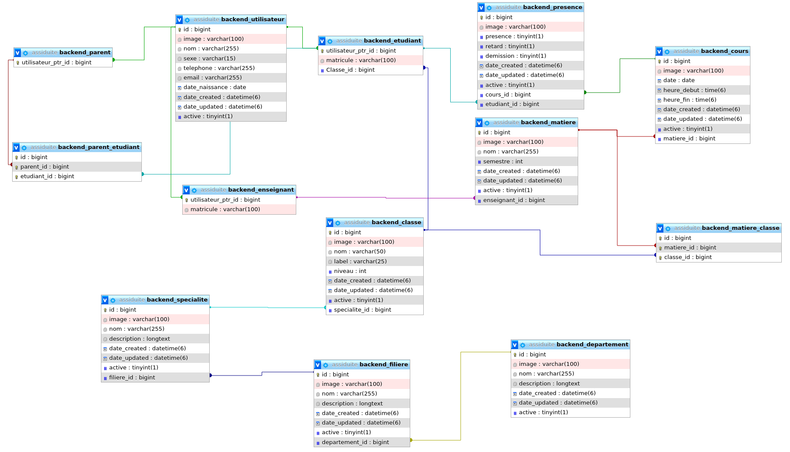

# backend-assiduit-
Back office - application de gestion de l'assiduité des étudiants

## Tables Schema from `phpMyAdmin`




## Start with `Docker`

> 👉 **Step 1** - Download the code from the GH repository (using `GIT`) 

```bash
$ git clone https://github.com/UlrichFeuyan/backend-assiduit-.git
$ cd backend-assiduit-
```

<br />

> 👉 **Step 2** - Start the APP in `Docker`

```bash
$ docker-compose up --build 
```

Visit `http://localhost:5085` in your browser. The app should be up & running.

<br />

## Environment

Create a new `.env` file using sample `env.sample`. The meaning of each variable can be found below: 

- `DEBUG`: if `True` the app runs in develoment mode
  - For production value `False` should be used
- For `MySql` persistence
  - Install the DB Driver: `pip install mysqlclient` 
  - Create DB and assign a new user (full rights) 
  - Edit `.env` to match the DB, user, password ..  

<br />

## Manual Build

> Download the code 

```bash
$ git clone https://github.com/UlrichFeuyan/backend-assiduit-.git
$ cd backend-assiduit-
```

<br />

### 👉 Set Up for `Unix`, `MacOS` 

> Install modules via `VENV`  

```bash
$ virtualenv env
$ source env/bin/activate
$ pip3 install -r requirements.txt
```

<br />

> Set Up Database

```bash
$ python manage.py makemigrations
$ python manage.py migrate
```

<br />

> Start the APP

```bash
$ python manage.py createsuperuser # create the admin
$ python manage.py runserver       # start the project
```

At this point, the app runs at `http://127.0.0.1:8000/`. 

<br />

### 👉 Set Up for `Windows` 

> Install modules via `VENV` (windows) 

```
$ virtualenv env
$ .\env\Scripts\activate
$ pip3 install -r requirements.txt
```

<br />

> Set Up Database

```bash
$ python manage.py makemigrations
$ python manage.py migrate
```

<br />

> Start the APP

```bash
$ python manage.py createsuperuser # create the admin
$ python manage.py runserver       # start the project
```


At this point, the app runs at `http://127.0.0.1:8000/`. 

<br />

<br />

## Codebase Structure

The project is coded using a simple and intuitive structure presented below:

```bash
< PROJECT ROOT >
   |
   |-- core/                            
   |    |-- settings.py                   # Project Configuration  
   |    |-- urls.py                       # Project Routing
   |
   |-- backend/
   |    |-- views.py                      # API Views 
   |    |-- urls.py                       # API Routing
   |    |-- models.py                     # API Models 
   |    |-- tests.py                      # Tests   
   |
   |-- requirements.txt                   # Project Dependencies
   |
   |-- env.sample                         # ENV Configuration (default values)
   |-- manage.py                          # Start the app - Django default start script
   |
   |-- ************************************************************************
```

<br />

<br />

## Deploy on [Render](https://render.com/)

- Create a Blueprint instance
  - Go to https://dashboard.render.com/blueprints this link.
- Click `New Blueprint Instance` button.
- Connect your `repo` which you want to deploy.
- Fill the `Service Group Name` and click on `Update Existing Resources` button.
- After that your deployment will start automatically.

At this point, the product should be LIVE.
